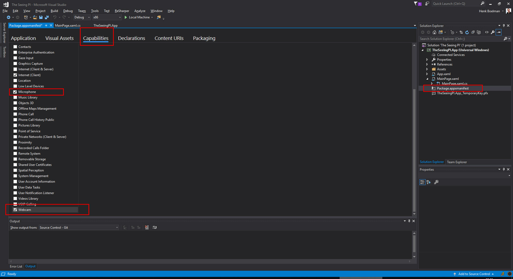
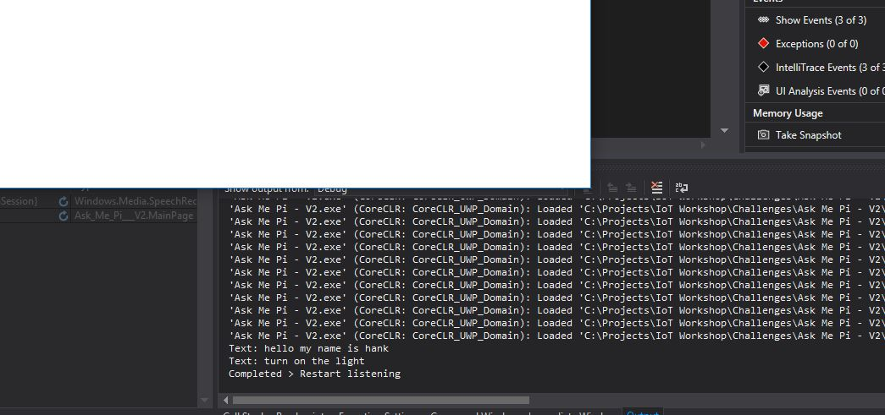
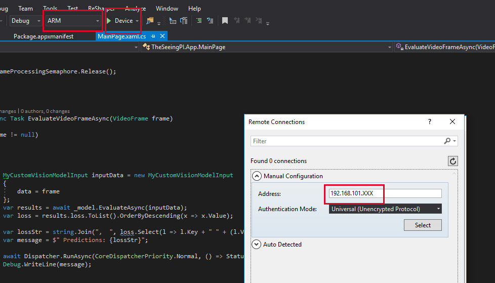

# Ask me PI


## Part 1 - Language Understanding

### Setup LUIS
* Go to [LUIS.AI](https://www.luis.ai) 
* Login with your Microsoft Pasport.


* Click "Create a new app"


* Enter a name for your app
* Click "create"


* Click "Create new intent"
* Type the intent name: "ControlLED"


* Enter the following examples:
    * Turn the light on
    * Turn the light off
    * Turn on the light
    * Turn the green light on
    * Put the light on
    * Put the red light off
    

* Click in the left menu "Entities"
* Click "Create new entity"
* Enter a name: "LedState"
* Click "done"
* Create another Entity "LedColor"


* Open "Intents"
* Open the intent "ControlLED"
* Click on the word "on"
* Select the Entity "LedState" in the dropdown
* Repeat this for all the words: "on" and "off"
* Select all the colors and link them to the entity "LedColor"


* Your project should look the picture above.

* Click the "train" button in the top right
* When the training is done click the "test" button


* Type the sentence: "turn the yellow light on"
* Notice that the word "yellow" and "on" are mapped to the corresponding entities.
* Try some other sentence


* Open the "publish" section
* Publish the app to production
* Scroll down en copy the API key
* Open the "settings" section 
* Copy the application id


## Part 2 - Build the UWP App

### 2.1 Create the app


* File > New Project
* Select: Visual C > Windows Universial > Blank App (Universial App)
* Select: Build 17134 (If you don't see this version please go back to the requirements for this workshop)

### 2.2 Enable the Microphone



* Open the "Package.appxmanifest" file
* Open the tab: "Capabilities"
* Check the checkbox "Webcam"
* Check the checkbox "Microphone"

### 2.3 Listen

* Open the file: "MainPage.xaml.cs
* Add this code to the class: "MainPage"
```
private SpeechRecognizer _contSpeechRecognizer;

protected override async void OnNavigatedTo(NavigationEventArgs e)
{
   _contSpeechRecognizer = new SpeechRecognizer();
   await _contSpeechRecognizer.CompileConstraintsAsync();
   _contSpeechRecognizer.ContinuousRecognitionSession.ResultGenerated +=ContinuousRecognitionSession_ResultGenerated;
   _contSpeechRecognizer.ContinuousRecognitionSession.Completed += ContinuousRecognitionSession_Completed;
   await _contSpeechRecognizer.ContinuousRecognitionSession.StartAsync();
}

private async void ContinuousRecognitionSession_Completed(SpeechContinuousRecognitionSession sender, SpeechContinuousRecognitionCompletedEventArgs args)
{
   Debug.WriteLine($"Completed > Restart listening");
   await _contSpeechRecognizer.ContinuousRecognitionSession.StartAsync();
}

private async void ContinuousRecognitionSession_ResultGenerated(SpeechContinuousRecognitionSession sender, SpeechContinuousRecognitionResultGeneratedEventArgs args)
{
   string speechResult = args.Result.Text;
   Debug.WriteLine($"Text: {speechResult}");
}
```
* Run the application and validate that you see what say in the debug output


### 2.4 Understand
* Add the nuget package: "Microsoft.Cognitive.LUIS" to the solution
* Open the file: "MainPage.xaml.cs
* Add this code to the class: "MainPage"
```
private readonly string _luiskey = "<LUIS KEY>";

private readonly string _appId = "<APP ID>";
```
*You can find this keys on www.luis.ai*

* Add this code to the method: "ContinuousRecognitionSession_ResultGenerated"
```
LuisClient client = new LuisClient(_appId,_luiskey);
LuisResult result = await client.Predict(speechResult);

Debug.WriteLine($"LUIS Result: {result.Intents.First().Name} {string.Join(",", result.Entities.Select(a => $"{a.Key}:{a.Value.First().Value}"))}");
```
* Run the application and validate that you see what say in the debug output
* Ask "Turn on the blue light". I you debug window you should see: "LUIS Result: ControlLED LedColor:blue,LedState:on"


### 2.6 Act
* Add the RGBLed module to your project. [View module](../modules/RGBLed.cs)
* Open the file: "MainPage.xaml.cs
* Add this code* Add this code to the class: "MainPage"
```
private readonly RGBLed _rgbLed = new RGBLed();

public void HandleLuisResult(LuisResult result)
{
   if (!result.Intents.Any())
   {
       return;
   }

   switch (result.Intents.First().Name)
   {
       case "ControlLED":

           if (result.Entities.Any(a => a.Key == "LedState"))
           {
               string ledState = result.Entities.First(a => a.Key == "LedState").Value.First().Value;

               if (ledState == "on")
               {
                   if (result.Entities.Any(a => a.Key == "LedColor"))
                   {
                       string ledColor = result.Entities.First(a => a.Key == "LedColor").Value.First().Value;

                        // INSERT SPEECH-1

                       switch (ledColor)
                       {
                           case "red":
                               _rgbLed.TurnOnLed(LedStatus.Red);
                               break;

                           case "green":
                               _rgbLed.TurnOnLed(LedStatus.Green);
                               break;

                           case "blue":
                               _rgbLed.TurnOnLed(LedStatus.Blue);
                               break;

                           case "purple":
                               _rgbLed.TurnOnLed(LedStatus.Purple);
                               break;
                       }
                   }
               }
               else if (ledState == "off")
               {
                   // INSERT SPEECH-2
                   _rgbLed.TurnOffLed();
               }
           }
           break;
   }
}
```
* Add this line to "ContinuousRecognitionSession_ResultGenerated" method just above the debug line.
```
HandleLuisResult(result);
```
* Run the application and validate your program in the debug window

  
* If you want the application only to responde to a specific keyword you can just wrap the code in the method "ContinuousRecognitionSession_ResultGenerated" with:
```
if (speechResult.ToLower().StartsWith("hey"))
{
   // CODE HERE
}
```

### 2.5 Speak
* Open the file: "MainPage.xaml.cs
* Add this code* Add this code to the class: "MainPage"
```
private readonly SpeechSynthesizer _synthesizer = new SpeechSynthesizer();
private readonly MediaPlayer _speechPlayer = new MediaPlayer();

public async Task SayAsync(string text)
{
   using (var stream = await _synthesizer.SynthesizeTextToStreamAsync(text))
   {
       _speechPlayer.Source = MediaSource.CreateFromStream(stream, stream.ContentType);
   }
   _speechPlayer.Play();
}

```
* Add this lines at the end of the "OnNavigatedTo" method.
```
var voice = SpeechSynthesizer.AllVoices.FirstOrDefault(i => i.Gender == VoiceGender.Female) ?? SpeechSynthesizer.DefaultVoice;
_synthesizer.Voice = voice;         
```
* Replace the line "// INSERT SPEECH-1" with:
```
 SayAsync($"Turning on the {ledColor} light.");
```

* Replace the line "// INSERT SPEECH-2" with:
```
SayAsync("Turning the light off.");
```

* Put in your headphone and validate that you hear the spoken text


## Part 3 - Run it on the RaspBerry PI 3

### 3.1 - Connect the wires
  

* Connect the display to the RaspBerry
* Connect all the wires exactly the same as in the schema below.

*Don't forget to remove the power*

### 3.2 - Deploy and run it on the device

* Select by debug the ARM profile
* Select "Device"
* Type the IP address of your Raspberry PI
* Select by protocol "Windows Universal"
* Click select
* Click the green play button to debug your solution on the PI
* The first time it can take a while to deploy, so this is a good time for some coffee!

## Part 4 - Optional
* Ask the PI more questions:
   * Eej PI what is my age? (Face API)
   * Eej PI who I'm I? (Face API)
   * Eej PI what is the room temperature? (Temp. sensor)
   * Eej PI "What is the meaning of life?" (Project answer)
   * Eej PI tell a joke ([A joke API](http://api.icndb.com/jokes/random))

