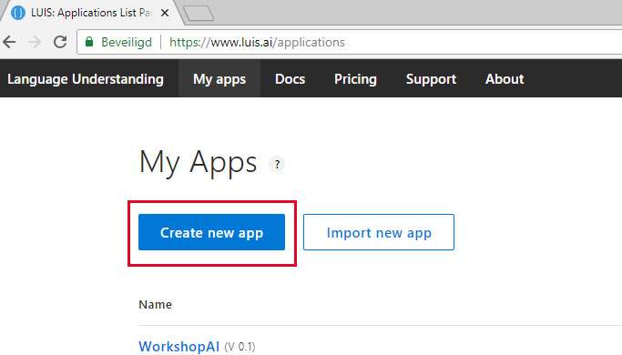
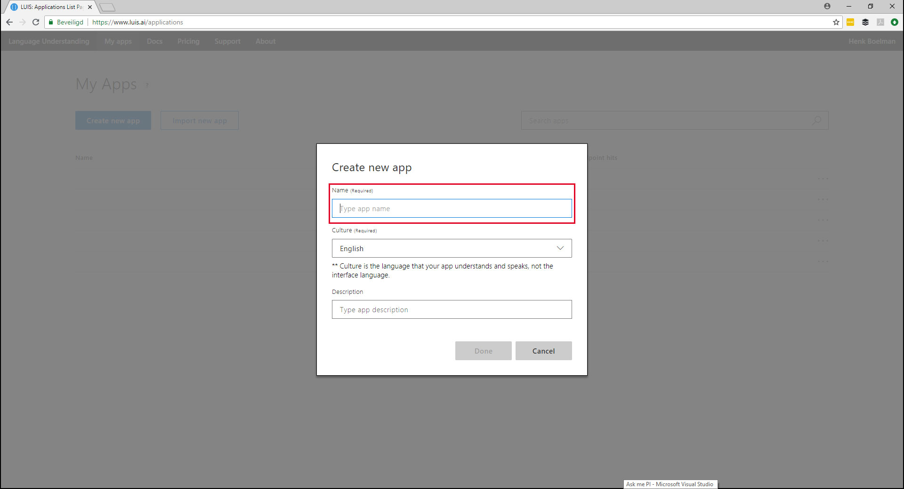
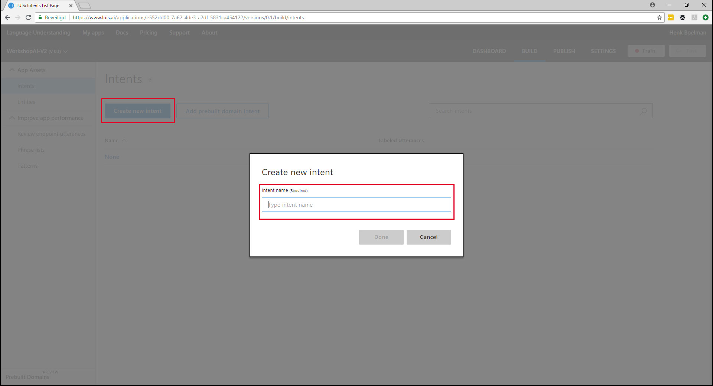
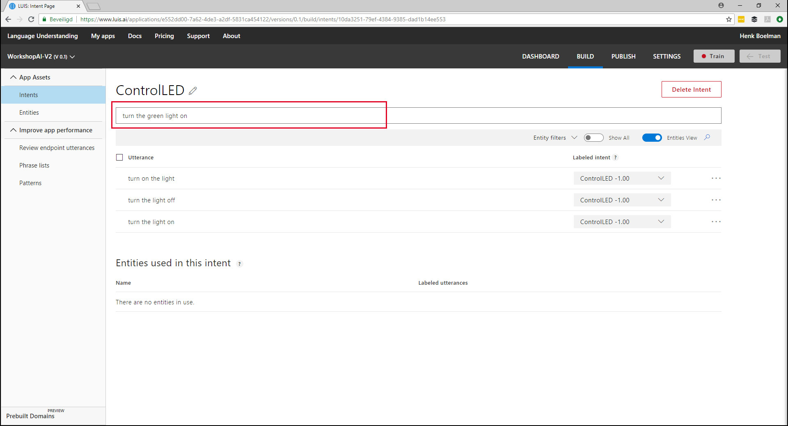
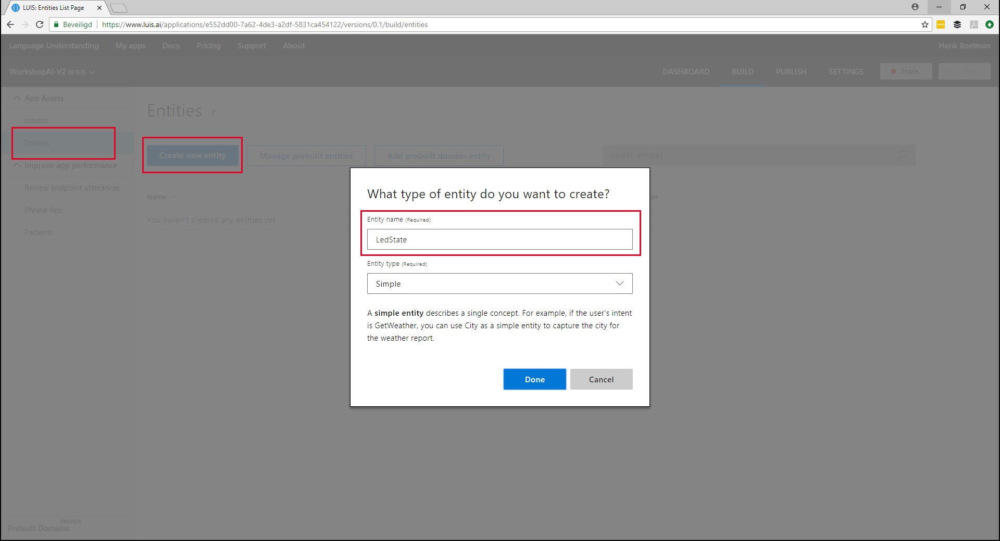
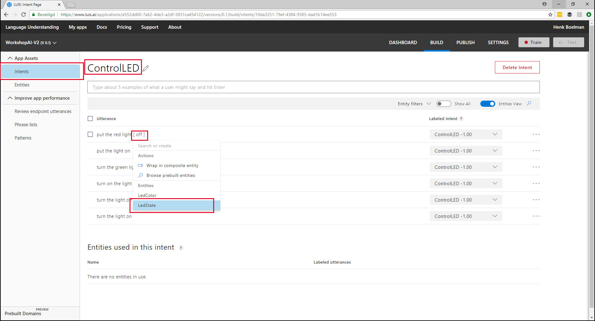
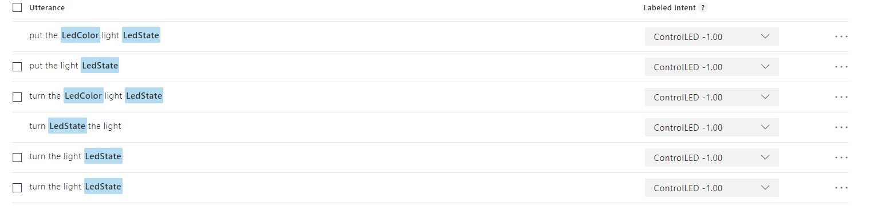
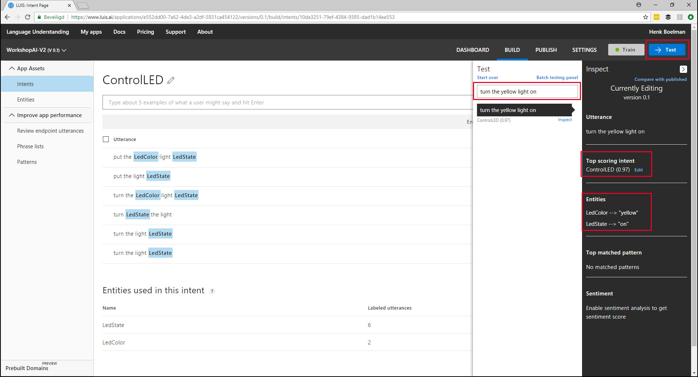
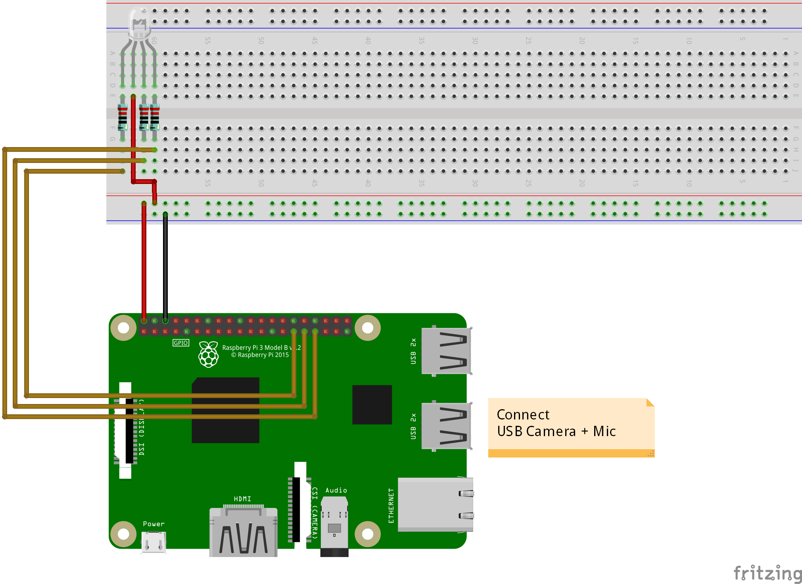

# Ask me PI

## Part 1 - Language Understanding

### Setup LUIS
* Go to [LUIS.AI](https://www.luis.ai) 
* Login with your Microsoft Pasport.

* Click "Create a new app"

* Enter a name for your app
* Click "create"

* Click "Create new intent"
* Type the intent name: "ControlLED"

* Enter the following examples:
    * Turn the light on
    * Turn the light off
    * Turn on the light
    * Turn the green light on
    * Put the light on
    * Put the red light off
    

* Click in the left menu "Entities"
* Click "Create new entity"
* Enter a name: "LedState"
* Click "done"
* Create another Entity "LedColor"

* Open "Intents"
* Open the intent "ControlLED"
* Click on the word "on"
* Select the Entity "LedState" in the dropdown
* Repeat this for all the words: "on" and "off"
* Select all the colors and link them to the entity "LedColor"

* Your project should look the picture up.

* Click the "train" button in the top right
* When the training is done click the "test" button

* Type the sentence: "turn the yellow light on"
* Notice that the word "yellow" and "on" are mapped to the corresponding entities.
* Try some other sentence

* Open the "publish" section
* Publish the app to production
* Scroll down en copy the API key
* Open the "settings" section 
* Copy the application id

## Part 2 - Build the UWP App

### 
* Add the nuget package: "Microsoft.Cognitive.LUIS"

## Part 3 - Run it on the RaspBerry PI 3
  

* Connect the display to the RaspBerry
* Connect all the wires exactly the same as in the schema below.

*Don't forget to remove the power*

