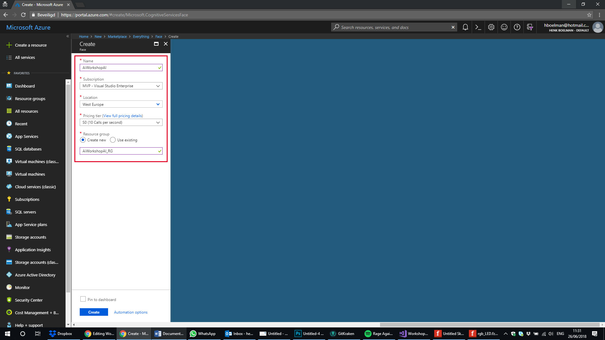
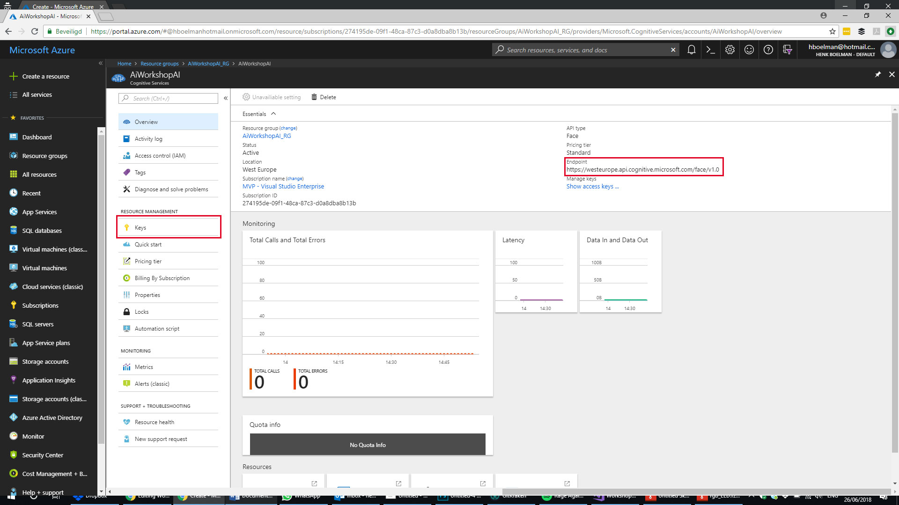

# Mood PI #

Welcome to the Mood PI challenge. In this challenge you are going to make the PI is reflect you mood.

> **Challenge**:   
> Make a program that runs on your Rapsberry PI and reflects your emotions in colors.

### Requirements 
- Use Emotions API
- Use the motion sensor to trigger to detection
- Use the RGB LED to show the emotion
  - Green = Smile
  - Blue = Neutral
  - Red = Anger

| . | . |
| ---- | ---- |
| **Difficulty** | Easy |
| **Duration** | 1-2 hours |
| **Challenge Points** | 10 points |
| **Modules** | Emotion API |
| **Sensors**| RGB LED / Motion Sensor / Camera |  

## Part 1 - Create a face API

* Login to the Azure Portal

* Create a Face API Endpoint [Create endpoint](https://portal.azure.com/#create/Microsoft.CognitiveServicesFace)


* Open your newly created Face API and copy the "API Key" and remember the region

# Part 2: Build the UWP App

### Create the app

* File > New Project
* Select: Visual C > Windows Universial > Blank App (Universial App)
* Select: Build 17134 (If you don't see this version please go back to the requirements for this workshop)

## 2.1 The camera

### Enable the Camera


* Open the "Package.appxmanifest" file
* Open the tab: "Capabilities"
* Check the checkbox "Webcam"

### Showing the camera feed

* Open the file: "MainPage.xaml"
* Add the code below between the "grid" tags:
```         
<StackPanel>
   <TextBlock x:Name="StatusText" FontWeight="Bold" TextWrapping="Wrap" Text="...."/>
   <CaptureElement Name="PreviewControl" Stretch="Uniform"/>
</StackPanel> 
```
* Open the file: "MainPage.xaml.cs
* Add this code to the class: "MainPage"
```
private readonly DisplayRequest _displayRequest = new DisplayRequest();

private readonly MediaCapture _mediaCapture = new MediaCapture();

private async Task StartVideoPreviewAsync()
{
   await _mediaCapture.InitializeAsync();
   _displayRequest.RequestActive();

   PreviewControl.Source = _mediaCapture;
   await _mediaCapture.StartPreviewAsync();
}
```
* Call the StartVideoPreviewAsync method from the constructor
* Run the application and validate you can see the camera feed

## 2.2 Analyze the camera feed

### Grabbing the frames from the camera

* Open the file: "MainPage.xaml.cs
* Add this code to the class: "MainPage"
```
private readonly SemaphoreSlim _frameProcessingSemaphore = new SemaphoreSlim(1);

private ThreadPoolTimer _frameProcessingTimer;

public VideoEncodingProperties VideoProperties;
```
* Add this lines to the "StartVideoPreviewAsync" method
```
TimeSpan timerInterval = TimeSpan.FromMilliseconds(66); //15fps
_frameProcessingTimer = ThreadPoolTimer.CreatePeriodicTimer(new TimerElapsedHandler(ProcessCurrentVideoFrame), timerInterval);
VideoProperties = _mediaCapture.VideoDeviceController.GetMediaStreamProperties(MediaStreamType.VideoPreview) as VideoEncodingProperties;
```
* Add this method:
```
private async void ProcessCurrentVideoFrame(ThreadPoolTimer timer)
{
   if (_mediaCapture.CameraStreamState != Windows.Media.Devices.CameraStreamState.Streaming || !_frameProcessingSemaphore.Wait(0))
   {
       return;
   }

   try
   {
        // Evaluate the image
        await Dispatcher.RunAsync(CoreDispatcherPriority.Normal, () => StatusText.Text = $"Analyzing frame {DateTime.Now.ToLongTimeString()}");
 
   }
   catch (Exception ex)
   {
       Debug.WriteLine("Exception with ProcessCurrentVideoFrame: " + ex);
   }
   finally
   {
       _frameProcessingSemaphore.Release();
   }
}

private async Task<MemoryStream> ConvertFromInMemoryRandomAccessStream(InMemoryRandomAccessStream inputStream)
{
    var reader = new DataReader(inputStream.GetInputStreamAt(0));
    var bytes = new byte[inputStream.Size];
    await reader.LoadAsync((uint)inputStream.Size);
    reader.ReadBytes(bytes);

    var outputStream = new MemoryStream(bytes);
    return outputStream;
}

```

* Run the application and validate that every second a frame is analyzed


## Add the face API
* Open the file: "MainPage.xaml.cs
* Add the NuGet package Microsoft.ProjectOxford.Face
* Add this code to the class: "MainPage"
```
private FaceServiceClient _faceServiceClient = new FaceServiceClient("1ce384247278493bb7961773fabb679f", "https://westeurope.api.cognitive.microsoft.com/face/v1.0");

public class EmotionResult
{
    public string Name { get; set; }

    public float Score { get; set; }
}
```
* In the "try" statement replace of the "ProcessCurrentVideoFrame" method replace everything with the code below:
```
var stream = new InMemoryRandomAccessStream();
await _mediaCapture.CapturePhotoToStreamAsync(ImageEncodingProperties.CreateJpeg(), stream);
MemoryStream memStream = await ConvertFromInMemoryRandomAccessStream(stream);

Face[] result = await _faceServiceClient.DetectAsync(memStream, false, false, new[] { FaceAttributeType.Emotion });

string displayText = $"{result.Length} faces found | {DateTime.Now.ToLongTimeString()}";

if (result.Any())
{
    List<EmotionResult> emotions = new List<EmotionResult>();
    emotions.Add(new EmotionResult() { Name = "Anger", Score = result.First().FaceAttributes.Emotion.Anger });
    emotions.Add(new EmotionResult() { Name = "Happiness", Score = result.First().FaceAttributes.Emotion.Happiness });
    emotions.Add(new EmotionResult() { Name = "Neutral", Score = result.First().FaceAttributes.Emotion.Neutral });

    displayText += string.Join(", ", emotions.Select(a => $"{a.Name}: {(a.Score * 100.0f).ToString("#0.00")}"));
}
await Dispatcher.RunAsync(CoreDispatcherPriority.Normal, () => StatusText.Text = displayText);

```
* Run the program and see the classification of the shown emotions.


## Part 3 - Run it on the RaspBerry PI 3


## Adding the motion sensor
* Open the file: "MainPage.xaml.cs
* Add this code to the class: "MainPage"
```
private bool _motion;

private GpioPin _motionPin;

private void InitPirSensor() {
    try
    {
        var gpio = GpioController.GetDefault();
        // Init the motion Sensor
        _motionPin = gpio.OpenPin(21);
        if (_motionPin != null)
        {
            _motionPin.SetDriveMode(GpioPinDriveMode.Input);
            _motionPin.ValueChanged += PirSensorChanged;
        }
    }
    catch (Exception e)
    {
        Debug.WriteLine("No GPIO ports found");
        _motion = true;
    }
}

private void PirSensorChanged(GpioPin sender, GpioPinValueChangedEventArgs args)
{
    _motion = (args.Edge == GpioPinEdge.RisingEdge);
}

```
*This codes enables the motion detection and sets the variable _motion true when motion is detected. If the motion sensor is not detected then _motion is set to true by default*
* Add the code below before the "try" statement of the "ProcessCurrentVideoFrame" method:
```
if (!_motion)
{
    Debug.WriteLine("No motion detected.");
    _frameProcessingSemaphore.Release();
    return;
}
```

## Adding the lights

