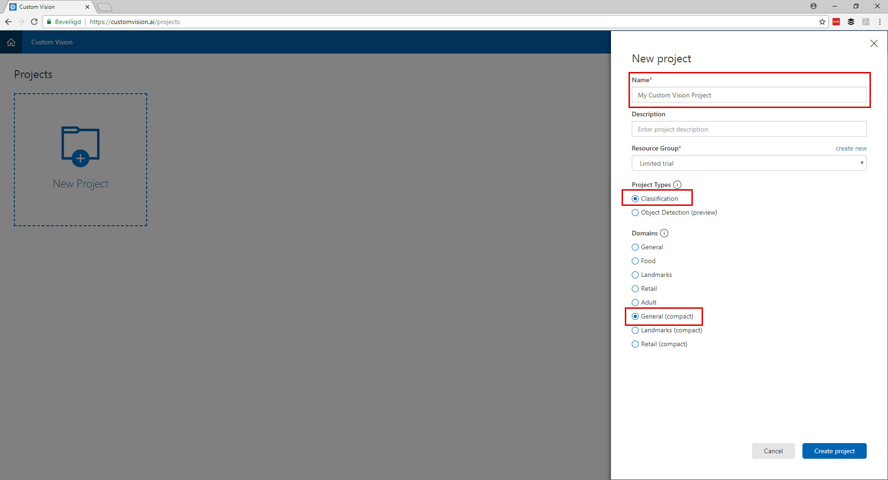
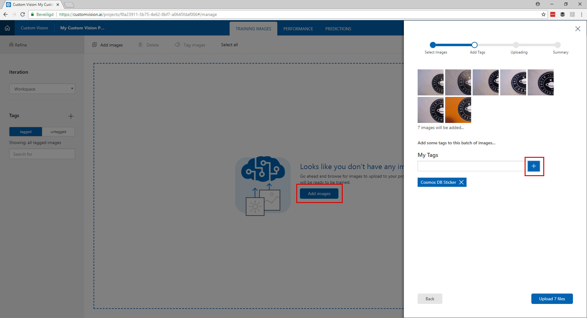
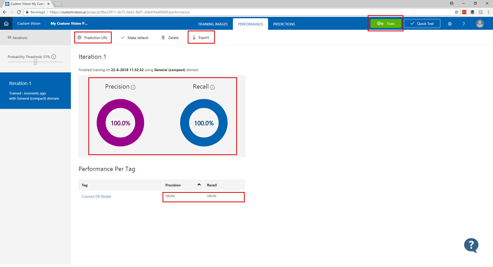
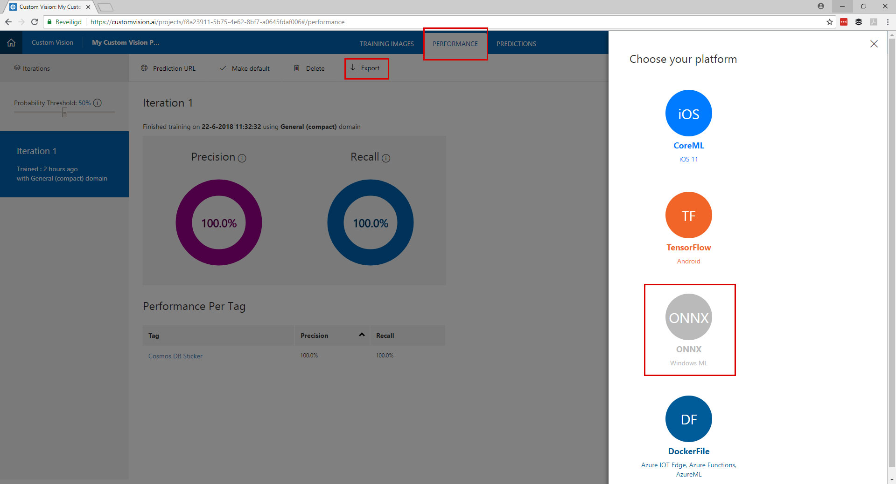
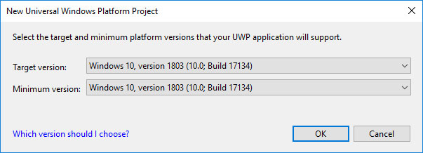

# The Seeing PI Challenge #

Welcome to the Seeing PI challenge. In this challenge you are going to create your own custom vision model and run it on your Raspberry PI to detect objects.

> **Challenge**:   
> Make a program that runs on your Rapsberry PI and can detect 3 different objects.

### Requirements 
- Use Custom Vision to train a model
- Use the motion sensor to trigger to detection
- Use the LED to show that the detection is in progress
- Display the result on the SPI Display

| . | . |
| ---- | ---- |
| **Difficulty** | Medium |
| **Duration** | 1-2 hours |
| **Challenge Points** | 10 points |
| **Modules** | Custom Vision |
| **Sensors**| SPI Display / Motion Sensor / LED |  

   
[INSERT VIDEO]
   

# Part 1 - Create your model

### Create your dataset
Find 3 objects in the room like your watch, phone, mouse, cup or any thing that classifies as an object.
Make at least 15 photos from these objects. Make sure you use different angles and backgrounds.
From the 15 pictures per object, set 2 aside for testing your model.

### Create a new project
Go to the website: [customvision.ai](https://www.customvision.ai) and login with a Microsoft account. 



### Upload & Tag your pictures
After creating your project you can start uploading you images. The best way is to upload and tag your images per project.



* Click "Add Images"
* Click "Browse some local files" (Can not exceed 4MB per image)
* Tag the images, type the tag and click on the + button
* Click the upload button
* Repeat these steps for all your objects

### Train your model
Now it is time to train your custom vision model. 
   


* Click in the top right on the green "Train" button     
The training will take only a few seconds. When the training is done you will see the performance and recall of the model. This should be above 90% if not you have to take some better pictures ;)
  
*Have a look at this screen and see that here you can find the API Endpoint and export the model*

### Test your model
Now you have trained the model it is time to test it.   
   

   
Click the "Quick Test" button in the top right, upload an image and see the results!


### Export the model
If your model works with your test set of images it is time to export the model to run in offline.
   

   
* Open the tab "Performance"
* Click on "Export"
* Download the ONNX model


## Building the UWP App for IoT Core 10


#### Create the app

* File > New Project
* Select: Visual C > Windows Universial > Blank App (Universial App)
* Select: Build 17134 (If you don't see this version please go back to the requirements for this workshop)


#### Enable the Camera


* Open the "Package.appxmanifest" file
* Open the tab: "Capabilities"
* Check the checkbox "Webcam"

#### Showing the camera feed

* Open the file: "MainPage.xaml"
* Add the code below between the <grid></grid> tags:
```         
<StackPanel>
   <TextBlock x:Name="StatusBlock" FontWeight="Bold" TextWrapping="Wrap" Text="...."/>
   <CaptureElement Name="PreviewControl" Stretch="Uniform"/>
</StackPanel> 
```
* Open the file: "MainPage.xaml.cs
* Add this code to the class: "MainPage"
```
private readonly DisplayRequest _displayRequest = new DisplayRequest();

private readonly MediaCapture _mediaCapture = new MediaCapture();

private async Task StartVideoPreviewAsync()
{
   await _mediaCapture.InitializeAsync();
   _displayRequest.RequestActive();

   PreviewControl.Source = _mediaCapture;
   await _mediaCapture.StartPreviewAsync();
}
```


## Enable the Screen


## Resources


* https://github.com/Azure-Samples/cognitive-services-onnx-customvision-sample
