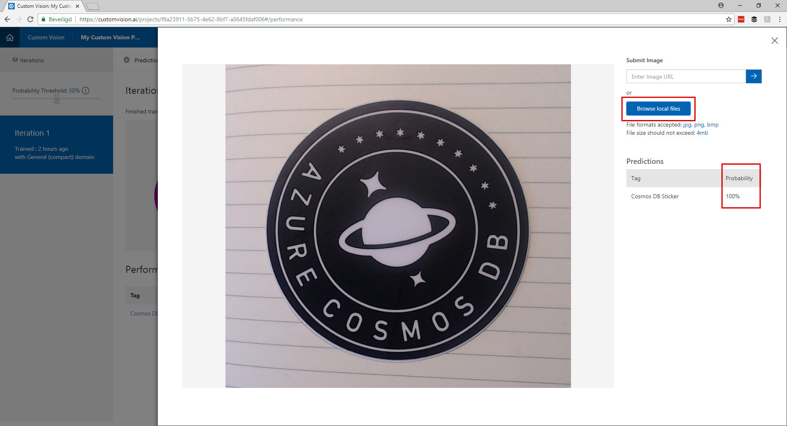

# The Seeing PI Challenge #

Welcome to the Seeing PI challenge. In this challenge you are going to create your own custom vision model and run it on your Raspberry PI to detect objects.

> **Challenge**:   
> Make a program that runs on your Rapsberry PI and can detect 3 different objects.

### Requirements 
- Use Custom Vision to train a model
- Use the motion sensor to trigger to detection
- Use the LED to show that the detection is in progress
- Display the result on the SPI Display

| . | . |
| ---- | ---- |
| **Difficulty** | Medium |
| **Duration** | 1-2 hours |
| **Challenge Points** | 10 points |
| **Modules** | Custom Vision |
| **Sensors**| SPI Display / Motion Sensor / LED |  

   
[INSERT VIDEO]
   

# Part 1 - Create your model

### Create your dataset
Find 3 objects in the room like your watch, phone, mouse, cup or any thing that classifies as an object.
Make at least 15 photos from these objects. Make sure you use different angles and backgrounds.
From the 15 pictures per object, set 2 aside for testing your model.

### Create a new project
Go to the website: [customvision.ai](https://www.customvision.ai) and login with a Microsoft account. 


### Upload & Tag your pictures
After creating your project you can start uploading you images. The best way is to upload and tag your images per project.


* Click "Add Images"
* Click "Browse some local files" (Can not exceed 4MB per image)
* Tag the images, type the tag and click on the + button
* Click the upload button
* Repeat these steps for all your objects

### Train your model
Now it is time to train your custom vision model. 
   


* Click in the top right on the green "Train" button     
The training will take only a few seconds. When the training is done you will see the performance and recall of the model. This should be above 90% if not you have to take some better pictures ;)
  
*Have a look at this screen and see that here you can find the API Endpoint and export the model*

### Test your model
Now you have trained the model it is time to test it.   
   

   
Click the "Quick Test" button in the top right, upload an image and see the results!


### Export the model
If your model works with your test set of images it is time to export the model to run in offline.
   

   
* Open the tab "Performance"
* Click on "Export"
* Download the ONNX model


## Building the UWP App for IoT Core 10


#### Create the app

* File > New Project
* Select: Visual C > Windows Universial > Blank App (Universial App)
* Select: Build 17134 (If you don't see this version please go back to the requirements for this workshop)


### Camera

#### Enable the Camera


* Open the "Package.appxmanifest" file
* Open the tab: "Capabilities"
* Check the checkbox "Webcam"

#### Showing the camera feed

* Open the file: "MainPage.xaml"
* Add the code below between the <grid></grid> tags:
```         
<StackPanel>
   <TextBlock x:Name="StatusText" FontWeight="Bold" TextWrapping="Wrap" Text="...."/>
   <CaptureElement Name="PreviewControl" Stretch="Uniform"/>
</StackPanel> 
```
* Open the file: "MainPage.xaml.cs
* Add this code to the class: "MainPage"
```
private readonly DisplayRequest _displayRequest = new DisplayRequest();

private readonly MediaCapture _mediaCapture = new MediaCapture();

private async Task StartVideoPreviewAsync()
{
   await _mediaCapture.InitializeAsync();
   _displayRequest.RequestActive();

   PreviewControl.Source = _mediaCapture;
   await _mediaCapture.StartPreviewAsync();
}
```
* Call the StartVideoPreviewAsync method from the constructor
* Run the application and validate you can see the camera feed


### Model

#### Import the model
* Rename the .onnx file you have downloaded in the previous step to "customvisionmodel.onnx" 
* Copy the customvisionmodel.onnx file to the Assets folder 
* Goto Solution Explorer in Visual Studio
* Right click on the Assets Folder > Add > Existing Item > Select the "customvisionmodel.onnx" file and click add.
* In the properties from the "customvisionmodel.onnx" set:  
     Build Action: Content
     Copy to output: Copy if newer
* Verify that you have a new file in the root of your project called: "mycustomvision.cs"


* Open the file and replace the generated code:
"**F8a23911_x002D_5b75_x002D_4e62_x002D_8bf7_x002D_a0645fdaf006_b5fd51a0_x002D_efd6_x002D_4400_x002D_af14_x002D_d5b0389eb89d**ModelInput"
to
public sealed class **MyCustomVisionModel**Input
* *Have a look at the "MyCustomVisionOutput" method and notice that you see you tags there, if your model changes you have to add or remove your new tags here.*

#### Load the model
* Open the file: "MainPage.xaml.cs
* Add this code to the class: "MainPage"
```    
private string _modelFileName = "mycustomvision.onnx";

private MyCustomVisionModel _model = null;

private async Task LoadModelAsync()
{
   await Dispatcher.RunAsync(CoreDispatcherPriority.Normal, () => StatusText.Text = $"Loading {_modelFileName}");

   var modelFile = await StorageFile.GetFileFromApplicationUriAsync(new Uri($"ms-appx:///Assets/{_modelFileName}"));
   _model = await MyCustomVisionModel.CreateMyCustomVisionModel(modelFile);

   await Dispatcher.RunAsync(CoreDispatcherPriority.Normal, () => StatusText.Text = $"Loaded {_modelFileName}");
}
```
* Call the LoadModelAsync method from the constructor
* Run the application and validate that the model is loaded

### Analyzing the camera feed

#### Grabbing the frames from the camera

* Open the file: "MainPage.xaml.cs
* Add this code to the class: "MainPage"
```
private readonly SemaphoreSlim _frameProcessingSemaphore = new SemaphoreSlim(1);

private ThreadPoolTimer _frameProcessingTimer;

public VideoEncodingProperties VideoProperties;
```
* Add this lines to the "StartVideoPreviewAsync" method
```
TimeSpan timerInterval = TimeSpan.FromMilliseconds(66); //15fps
_frameProcessingTimer = ThreadPoolTimer.CreatePeriodicTimer(new TimerElapsedHandler(ProcessCurrentVideoFrame), timerInterval);
VideoProperties = _mediaCapture.VideoDeviceController.GetMediaStreamProperties(MediaStreamType.VideoPreview) as VideoEncodingProperties;
```
* Add this method:
```
private async void ProcessCurrentVideoFrame(ThreadPoolTimer timer)
{
   if (_mediaCapture.CameraStreamState != Windows.Media.Devices.CameraStreamState.Streaming || !_frameProcessingSemaphore.Wait(0))
   {
       return;
   }

   try
   {
       using (VideoFrame previewFrame = new VideoFrame(BitmapPixelFormat.Bgra8, (int)VideoProperties.Width, (int)VideoProperties.Height))
       {
           await _mediaCapture.GetPreviewFrameAsync(previewFrame);

           // Evaluate the image
           await Dispatcher.RunAsync(CoreDispatcherPriority.Normal, () => StatusText.Text = $"Analyzing frame {DateTime.Now.ToLongTimeString()}");

       }
   }
   catch (Exception ex)
   {
       Debug.WriteLine("Exception with ProcessCurrentVideoFrame: " + ex);
   }
   finally
   {
       _frameProcessingSemaphore.Release();
   }
}
```

* Run the application and validate that every second a frame is analyzed


#### Scoring the frames
* Open the file: "MainPage.xaml.cs
* Add this code to the class: "MainPage"
```
private async Task EvaluateVideoFrameAsync(VideoFrame frame)
{
   if (frame != null)
   {
       try
       {

           MyCustomVisionModelInput inputData = new MyCustomVisionModelInput
           {
               data = frame
           };
           var results = await _model.EvaluateAsync(inputData);
           var loss = results.loss.ToList().OrderByDescending(x => x.Value);

           var lossStr = string.Join(",  ", loss.Select(l => l.Key + " " + (l.Value * 100.0f).ToString("#0.00") + "%"));
           var message = $" Predictions: {lossStr}";

           await Dispatcher.RunAsync(CoreDispatcherPriority.Normal, () => StatusText.Text = message);
           Debug.WriteLine(message);

       }
       catch (Exception ex)
       {
           Debug.WriteLine($"error: {ex.Message}");
       }
   }
}
```
* In the "ProcessCurrentVideoFrame" method replace:
```
// Evaluate the image
await Dispatcher.RunAsync(CoreDispatcherPriority.Normal, () => StatusText.Text = $"Analyzing frame {DateTime.Now.ToLongTimeString()}");
```
with
```
await Task.Run(async () =>
{
   await EvaluateVideoFrameAsync(previewFrame);
});
```
* Run the application and validate that you see the classification of every frame, you can hold the objects in front of the camera an see if it is working.


*You application should look like this now*

### Running it on the RaspBerry PI 3

#### Display the result on the SPI display


## Resources
* https://github.com/Azure-Samples/cognitive-services-onnx-customvision-sample
