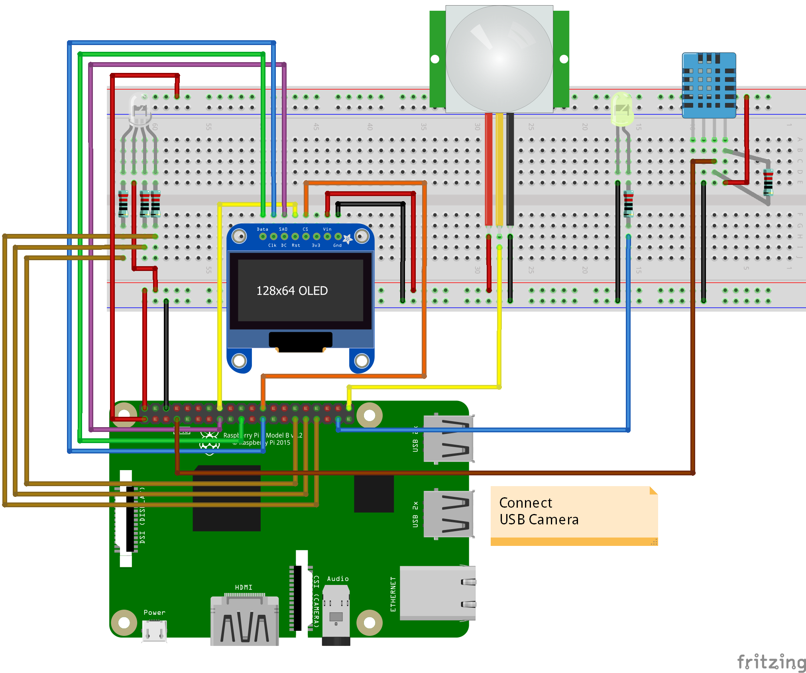

# Setup the board

### Download and install IoT dashboard
Download and install the IoT dashboard tool. 
[Download](http://go.microsoft.com/fwlink/?LinkID=708576)

### Connect the wires

### Bootup the device
Connect the Raspberry to the power.

### Open the dashboard

|Username|Password|
| --- | --- |
| administrator | 123456 |

### Install the program

### Validate your setup
- RGB Led - Should be showing every 1 second a different color
- Display - Should show the current time & temperature
- Motion Sensor / Yellow LED - When motion is triggered the yellow led should light up
