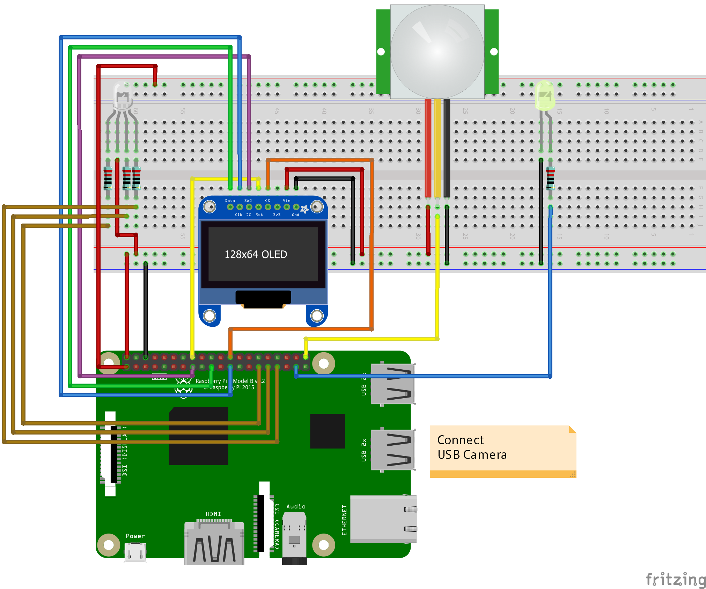
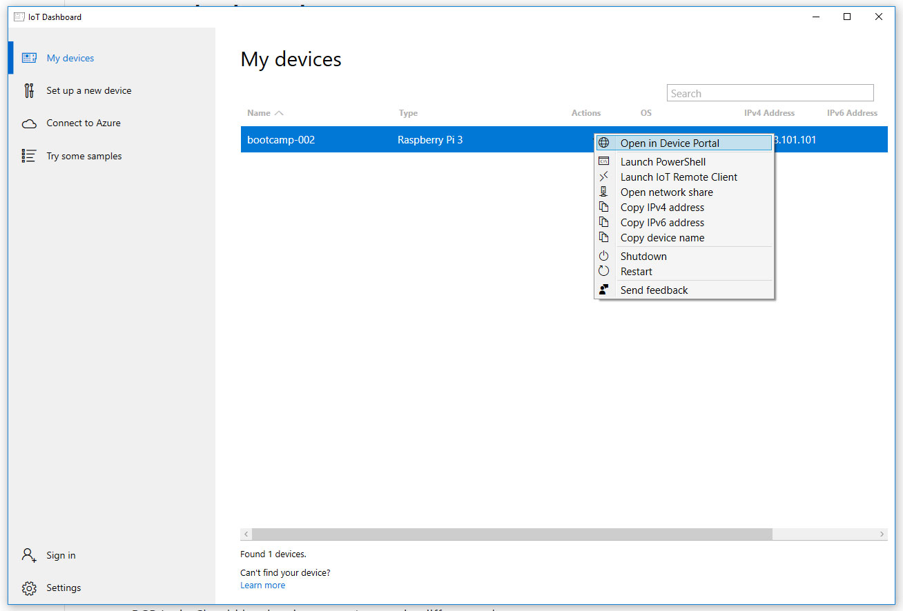

# Setup the board

### 1. Download and install IoT dashboard
Download and install the IoT dashboard tool. 
[Download](http://go.microsoft.com/fwlink/?LinkID=708576)

### 2. Connect the wires

### 3. Bootup the device
Connect the Raspberry to the power.

### 4. Open the dashboard
* Open the IoT Dashboard tool and find your device in the list. 
* Click on the ... under actions and select "Open device in portal"
* Login in to the device using the details below 

| Username | Password |
| --- | --- |
| administrator | 123456 |

* Have a look around in the dashboard

### 5. Install the program
* Download the sample [Download](Assets/WorkshopDemo.zip)
* Unzip "WorkshopDemo.zip"
* In the device portal go to: Apps > Apps Manager
* *If you see the app: "WorkshopDemo" use the right dropdown to uninstall it*
* Click the "add" button
* Upload the file "WorkshopDemo_1.2.3.0_x86_x64_arm_Debug.appxbundle"
* Check the box by: "I want to specify framework packages"
* Upload the files: "Microsoft.NET.CoreRuntime.2.1.appx" and "Microsoft.VCLibs.ARM.Debug.14.00.appx"
* Click the blue button "Start"
* After uploading click done, you should see "WorkshopDemo" in the list of apps
* In the actions dropdown click: Start
* The application should startup and the motion sensor, leds and screen should be working.

### 6. Validate your setup
- RGB Led - Should be showing every 1 second a different color
- Display - Should show the current time & temperature
- Motion Sensor / Yellow LED - When motion is triggered the yellow led should light up
